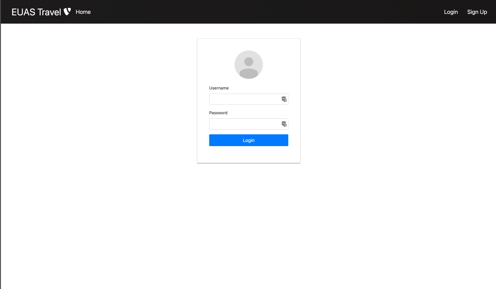
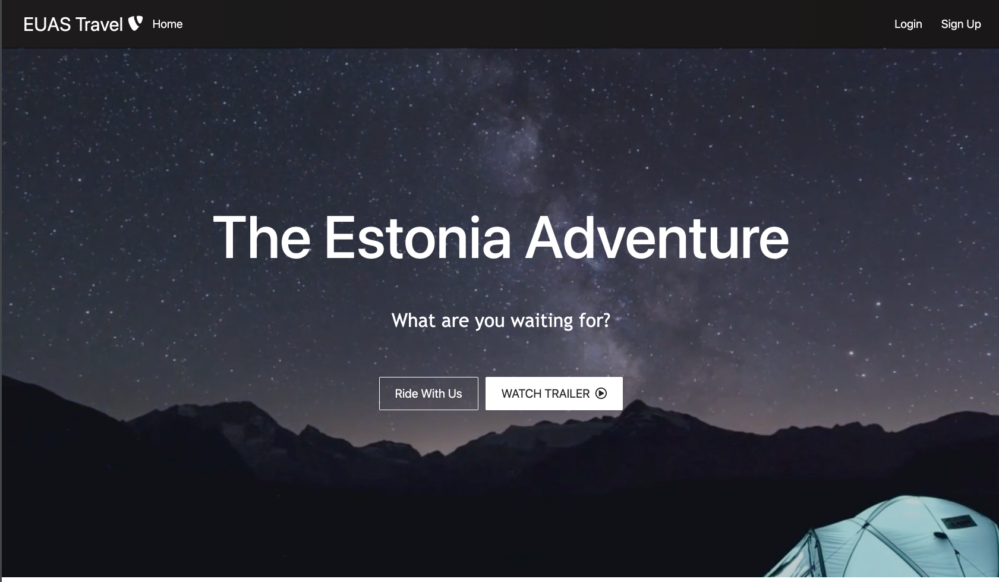
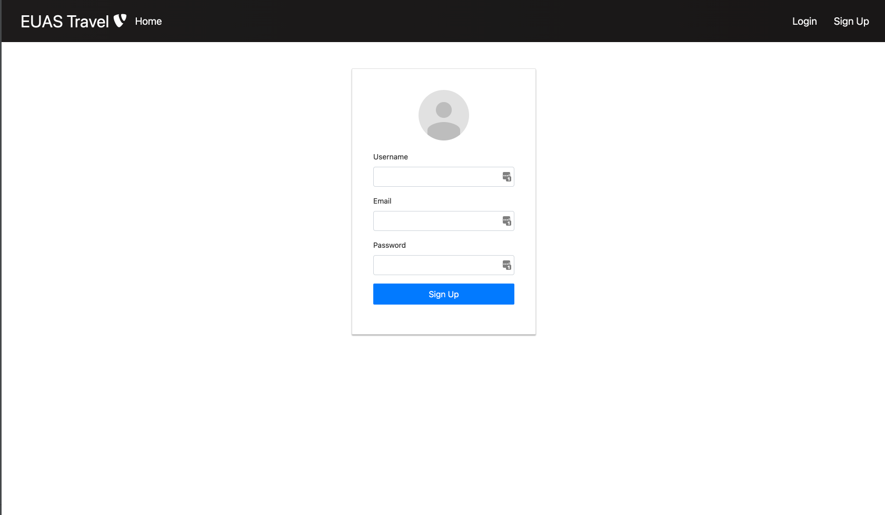
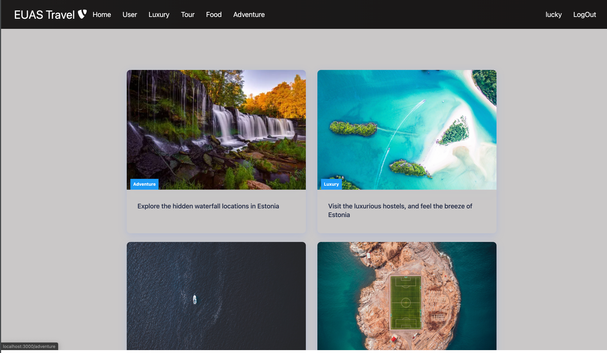
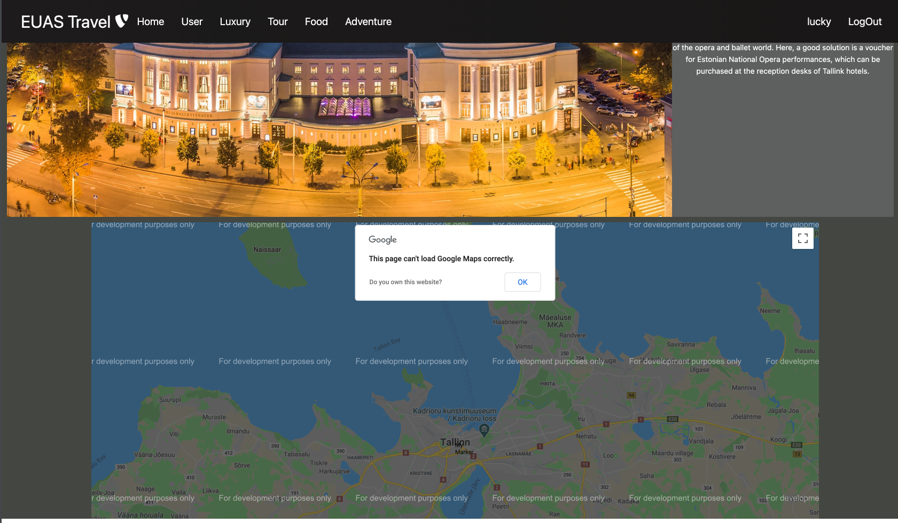
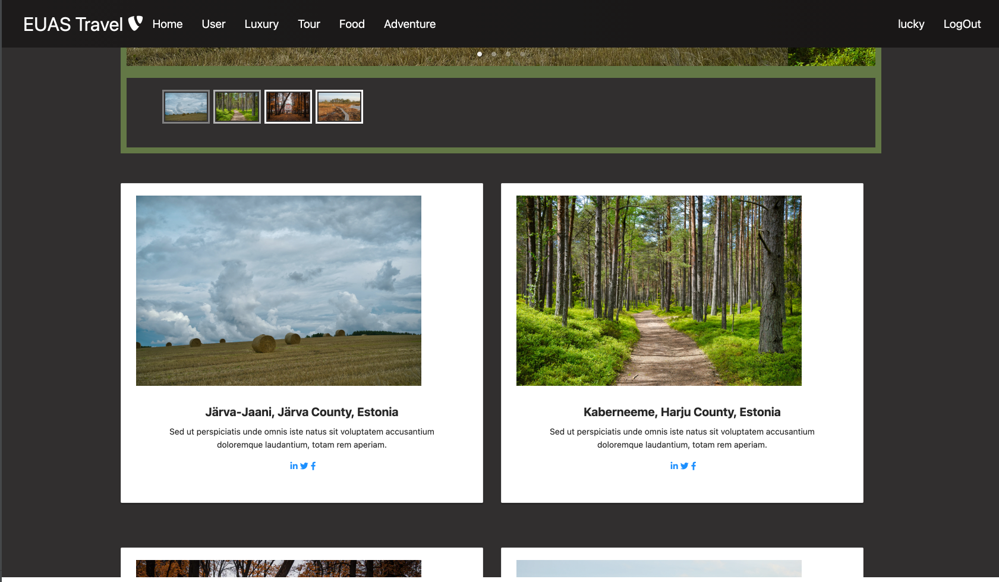
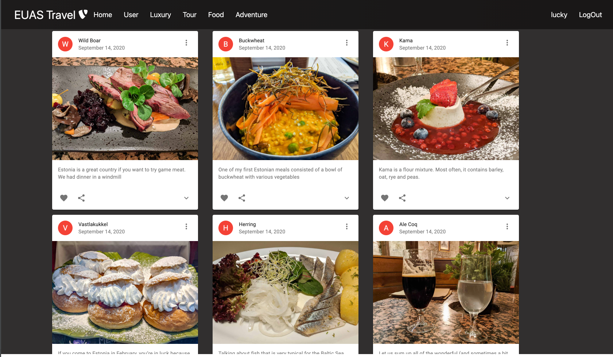
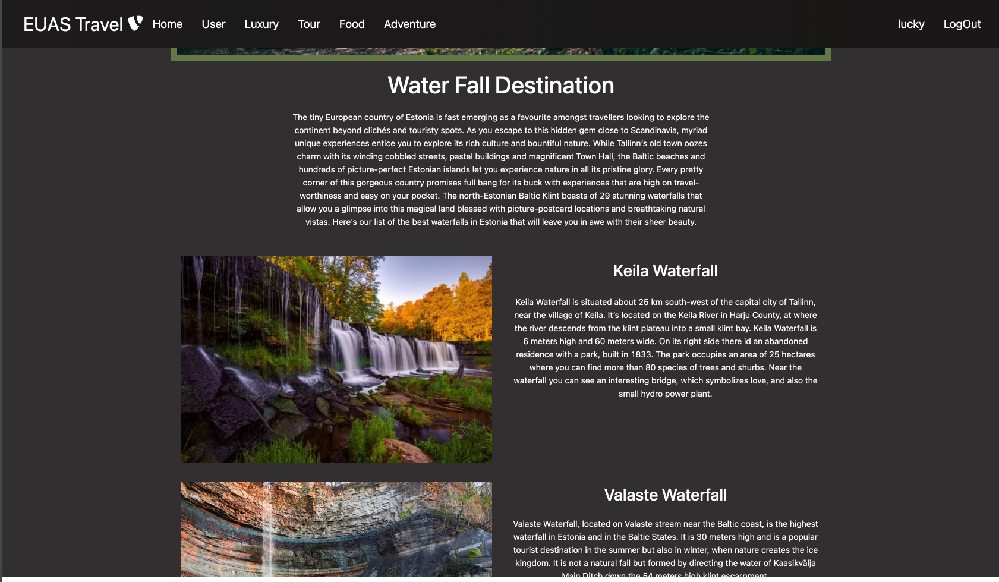

[![NPM version][npm-image]][npm-url]
[](https://travis-ci.com/github/Clogogo/Booking-App-Frontend)
                                                                                      <br />
## Description of Project 










## Run frontend

    $ git clone https://github.com/Clogogo/Booking-App-Frontend.git
   

## Project setup

In the project directory, you can run:

```
npm install
# or
yarn install
```

or

### Compiles and hot-reloads for development

```
npm start
# or
yarn start

The page will reload if you make edits.
```
#### Login
You can create user accounts by signing up 

explore pages